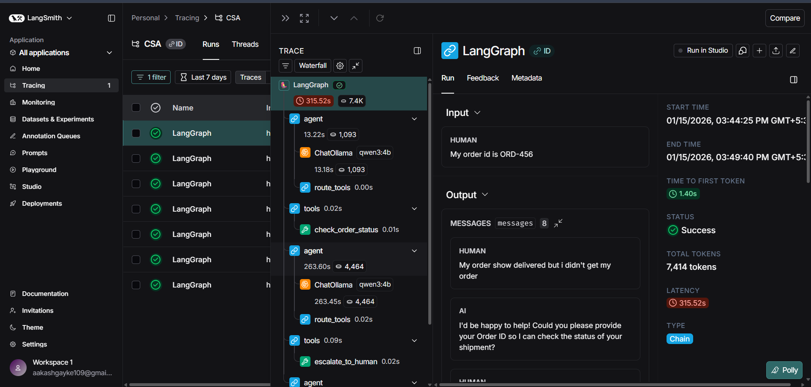

# 🏥 Hospital AI Assistant

An **AI-powered assistant that helps patients prepare for hospitalisation** by answering questions about admission, surgery preparation, discharge, and follow-up care.

This project demonstrates how to build a **tool-using AI agent with LangGraph, RAG, and Streamlit**.

The assistant retrieves hospital knowledge from a **PDF knowledge base** and provides structured responses to patients.

---

# 🚀 Features

### 🧠 AI Agent (LangGraph)

* Uses **LangGraph workflow**
* Supports **tool calling**
* Maintains **conversation memory with SQLite**

### 📚 RAG Knowledge Base

* Uses **FAISS vector database**
* Embeddings from **HuggingFace sentence-transformers**
* Retrieves hospital documents dynamically

### 🏥 Hospital Guidance

The assistant helps patients understand:

* Admission requirements
* Documents required for hospitalisation
* Pre-surgery preparation
* Hospital discharge process
* Post-hospital follow-up care

### 🛠 Tools Used by Agent

| Tool                        | Purpose                                 |
| --------------------------- | --------------------------------------- |
| hospital_knowledge_tool     | Retrieves hospital information from RAG |
| surgery_details_tool        | Returns patient surgery schedule        |
| contact_representative_tool | Provides hospital support contact       |

### 💬 Interactive Chat Interface

* Built with **Streamlit**
* Chat-style UI
* Session-based conversations
* Multi-thread conversation history

---

# 🏗 System Architecture

The AI assistant follows a **tool-augmented agent workflow**.

```
User Query
   ↓
Streamlit UI
   ↓
LangGraph Agent
   ↓
Tool Selection
   ↓
RAG Retrieval / Hospital System
   ↓
Final Response
```

---

# 📂 Project Structure

```
Project/
│
├── app.py                # Streamlit UI
├── main.py               # LangGraph agent workflow
├── tools.py              # Agent tools
├── prompt.py             # System prompt
├── requirements.txt
│
└── rag/
    ├── retriever.py
    ├── vectorstores/
    └── docs/
        ├── ADMISSION_DOCS
        │   └── admission_requirements.pdf
        │
        ├── PREPARATION_DOCS
        │   └── pre_surgery_preparation.pdf
        │
        ├── DISCHARGE_DOCS
        │   └── hospital_discharge_process.pdf
        │
        └── FOLLOWUP_DOCS
            └── post_hospital_followup.pdf
```

---

# ⚙️ Tech Stack

| Technology                 | Usage                        |
| -------------------------- | ---------------------------- |
| **LangChain**              | LLM framework                |
| **LangGraph**              | Agent workflow orchestration |
| **Streamlit**              | Frontend interface           |
| **FAISS**                  | Vector database              |
| **HuggingFace Embeddings** | Text embeddings              |
| **Ollama (Qwen model)**    | Local LLM                    |
| **SQLite**                 | Chat memory storage          |

---

# 📚 Knowledge Base

The assistant uses **RAG (Retrieval Augmented Generation)** to retrieve hospital documents.

Categories:

* Admission Documents
* Surgery Preparation
* Hospital Discharge
* Post-Hospital Follow-up

Each category has its own **FAISS vector index**.

---

# 🧠 AI Agent Workflow

The LangGraph workflow contains two main nodes:

```
START
  ↓
Agent Node (LLM)
  ↓
Tool Router
  ↓
Tool Node
  ↓
Agent Node
  ↓
END
```

The agent decides which tool to use based on the user query.

---

# ▶️ How to Run the Project

### 1️⃣ Clone the Repository

```bash
git clone https://github.com/your-username/hospital-ai-assistant.git
cd hospital-ai-assistant
```

---

### 2️⃣ Install Dependencies

```bash
pip install -r requirements.txt
```

---

### 3️⃣ Start the Local LLM (Ollama)

Make sure **Ollama** is installed and running.

```bash
ollama run qwen3:4b
```

---

### 4️⃣ Run the Application

```bash
streamlit run app.py
```

---

### ⚙️ Automatic Vector Store Creation

The system automatically creates the **FAISS vector database** when the application runs for the first time.

When a query is received, the system:

1. Checks if a vector database exists
2. If not, it **loads PDF documents**
3. **Splits them into chunks**
4. **Generates embeddings**
5. **Creates a FAISS index**

This process is handled automatically by `retriever.py`.

---

# 🔄 Agent Workflow

The assistant uses **LangGraph** to manage the AI agent workflow.

The agent follows this process:

1️⃣ User sends a query from the Streamlit UI
2️⃣ Query is passed to the **LangGraph Agent**
3️⃣ The agent decides whether a **tool is required**
4️⃣ If needed, the tool retrieves information (RAG / system data)
5️⃣ The response is returned to the user

---

### Workflow Diagram


---

# 🔍 LangSmith Monitoring

The project integrates **LangSmith-style tracing** to monitor agent execution.

This allows developers to observe:

* LLM reasoning
* Tool calls
* RAG retrieval
* Agent decision flow

This is very useful for **debugging AI agents and improving prompts**.

---

### LangSmith Trace Example




---

# 💬 Example Questions

Users can ask questions like:

* What documents are required for hospital admission?
* What should I bring before surgery?
* What happens during hospital discharge?
* What follow-up care is needed after hospitalisation?
* What is the surgery schedule for patient **P1001**?

---

# 🧠 Learning Outcomes

This project demonstrates:

* Building **tool-using AI agents**
* Implementing **Retrieval Augmented Generation (RAG)**
* Creating **LangGraph workflows**
* Designing **LLM-powered applications**
* Building **AI chat interfaces with Streamlit**
* Monitoring agents using **LangSmith traces**

---

# 👨‍💻 Author

**Aakash**

Aspiring **AI Engineer / ML Engineer**
